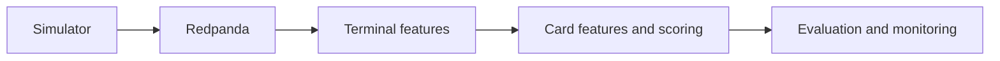

# Streaming fraud detection

A simulated event-time fraud pipeline and cost-sensitive evaluation study.

```mermaid
flowchart LR
  S[Simulator] --> B[Redpanda]
  B --> T[Terminal features]
  T --> C[Card features and scoring]
  C --> E[Evaluation and monitoring]
```

<!-- results:start -->
Not yet measured.
<!-- results:end -->
